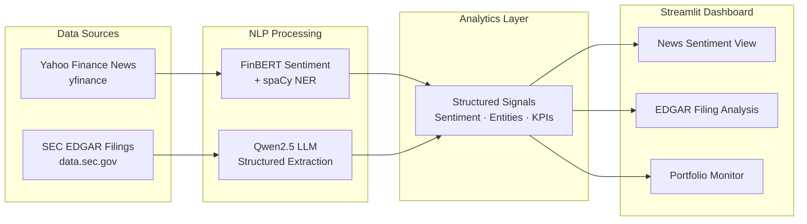
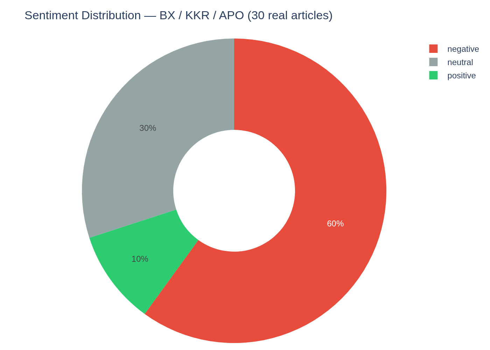
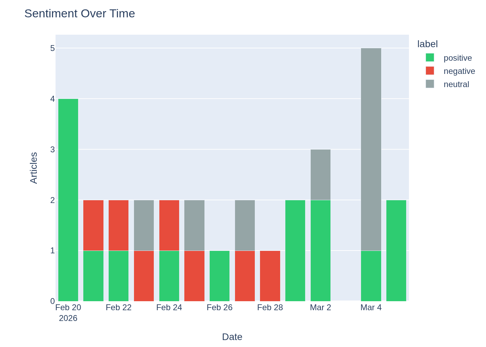
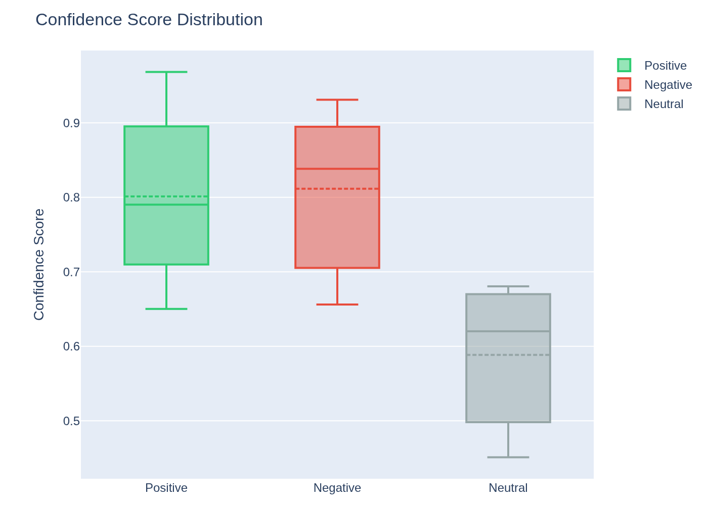
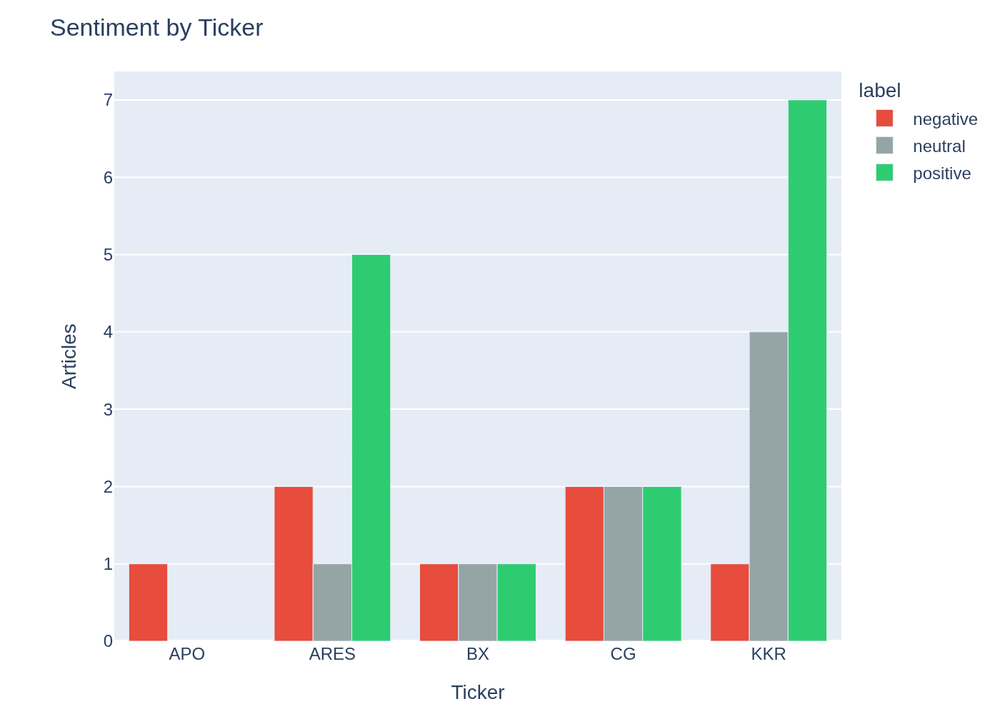
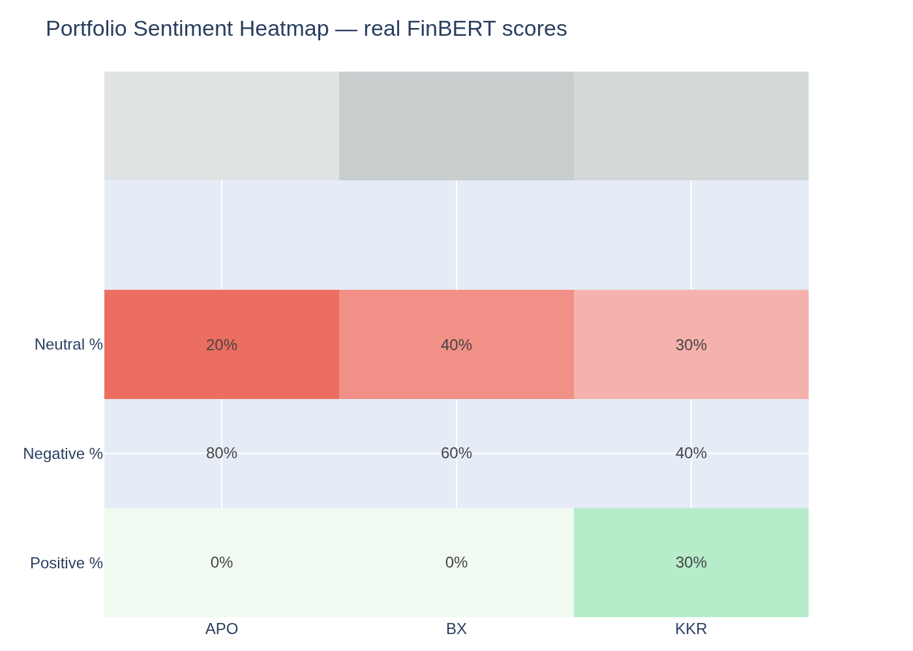
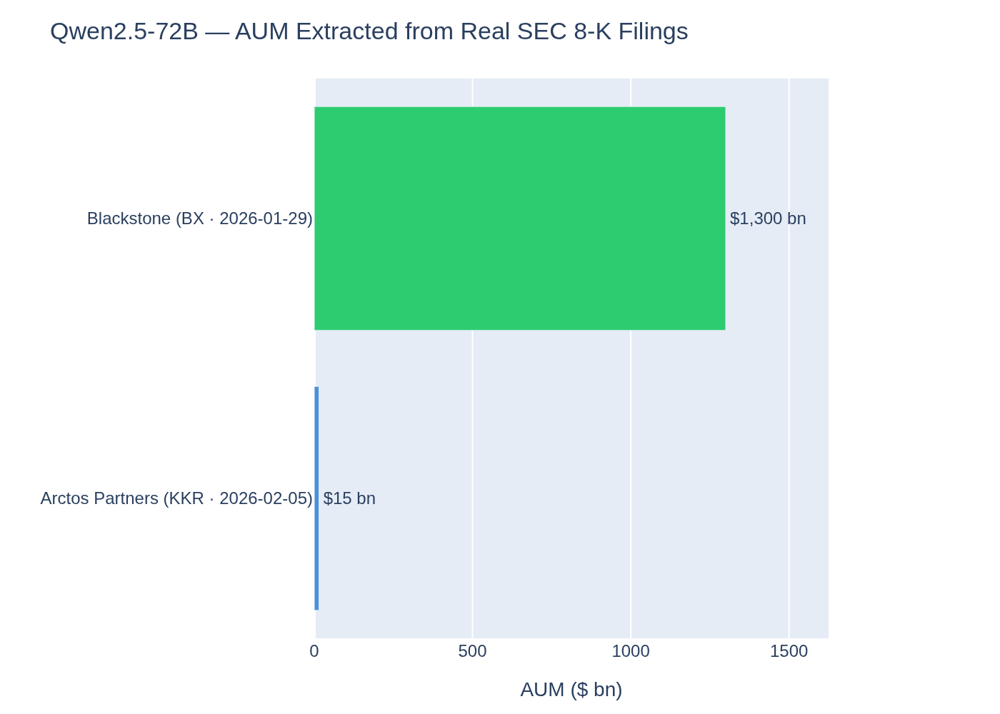

# Financial Intelligence Dashboard

> Applied NLP for alternative asset managers — FinBERT sentiment, LLM-structured SEC filing extraction, and portfolio monitoring in a single Streamlit dashboard.


---

## What it does

| Feature | Detail |
|---|---|
| **News Sentiment** | FinBERT scores Yahoo Finance headlines (positive / negative / neutral + confidence) per ticker |
| **Named Entity Recognition** | spaCy extracts ORG, PERSON, GPE entities from article text |
| **LLM Investment Briefing** | Qwen2.5-72B synthesises a 3-sentence PM brief from live headlines |
| **SEC EDGAR Ingest** | Fetches 8-K / 10-K press-release text from `data.sec.gov` — no API key |
| **LLM Structured Extraction** | Extracts AUM, IRR, TVPI, DPI, risks & opportunities as typed JSON from filing text |
| **Portfolio Monitor** | Batch-scan multiple tickers; colour-coded sentiment heatmap across holdings |
| **CSV Export** | All results downloadable for Databricks / Power BI integration |

---

## Architecture



---

## Screenshots

| Sentiment Distribution | Sentiment Over Time | Score Distribution |
|:---:|:---:|:---:|
|  |  |  |

| By Ticker | Portfolio Heatmap | LLM-Extracted KPIs |
|:---:|:---:|:---:|
|  |  |  |

---

## Quickstart

```bash
git clone https://github.com/hades2905/fintext-signal-dashboard
cd fintext-signal-dashboard

python -m venv .venv && source .venv/bin/activate
pip install -r requirements.txt
python -m spacy download en_core_web_sm

export HF_TOKEN=hf_...   # free at huggingface.co/settings/tokens

streamlit run dashboard/app.py
```

Yahoo Finance and SEC EDGAR require no API key. A free HuggingFace token is the only credential needed — no billing, no local GPU.

---

## Stack

| Component | Model / Library |
|---|---|
| Sentiment | [ProsusAI/FinBERT](https://huggingface.co/ProsusAI/finbert) — fine-tuned on 10 k financial sentences |
| Structured extraction | [Qwen/Qwen2.5-72B-Instruct](https://huggingface.co/Qwen/Qwen2.5-72B-Instruct) via HF Inference API |
| NER | spaCy `en_core_web_sm` (local, ~12 MB) |
| News | yfinance (Yahoo Finance) |
| Filings | SEC EDGAR `data.sec.gov` public API |
| UI | Streamlit · Plotly |
| Validation | Pydantic v2 |

---

## Supported Tickers

| Ticker | Company | Strategy |
|---|---|---|
| BX | Blackstone | PE / RE / Credit / Infra |
| KKR | KKR & Co. | PE / Credit / Infra |
| APO | Apollo Global Management | PE / Credit |
| ARES | Ares Management | Credit / PE / RE |
| CG | Carlyle Group | PE / Credit / RE |
| BAM | Brookfield Asset Management | Infra / RE / PE |

Any ticker symbol works via Yahoo Finance news. CIK auto-lookup handles unknown EDGAR tickers.

---

## Real Example Data

All files in `examples/data/` are generated from live APIs — no mocks. Refresh with `python examples/fetch_real_data.py`.

| File | Contents |
|---|---|
| `news_articles_scored.json` | 30 articles (BX / KKR / APO) + FinBERT scores |
| `edgar_filings.json` | 4 real 8-K filings (BX Q4 2025, KKR Q4 2025, KKR/Arctos) |
| `llm_extractions.json` | Qwen2.5-72B structured extracts per filing |
| `investment_briefings.json` | Qwen2.5-72B PM briefings for BX / KKR / APO |
| `top_entities.json` | Top 20 NER entities by mention count |

**Sample — KKR / Arctos acquisition extract (`llm_extractions.json`)**

```json
{
  "fund_or_entity_name": "Arctos Partners",
  "geography": "North America",
  "aum_bn_usd": 15.0,
  "vintage_year": 2019,
  "overall_sentiment": "positive",
  "key_opportunities": [
    "Better serve the sports industry and the sponsor community",
    "Access to strategic, financial and operational resources to accelerate existing businesses",
    "Leverage KKR's broad range of products and capabilities"
  ],
  "investment_summary": "Arctos Partners, a leader in sports franchise investments and GP solutions, is being acquired by KKR, enhancing its capabilities and positioning for growth."
}
```

---

## Development

```bash
# Unit tests — fully offline, all HTTP mocked (~7 s)
pytest -m "not integration"

# Integration tests — live EDGAR + Yahoo Finance (~60 s)
pytest -m integration -v

ruff check .
```

---

## Use Cases

| Workflow | How this project applies |
|---|---|
| GP letter / fund update ingestion | LLM extracts AUM, IRR, DPI, TVPI without manual reading |
| Portfolio monitoring | Batch sentiment scan identifies emerging risks across holdings |
| Filing surveillance | 8-K monitoring surfaces material events in portfolio companies |
| Quantitative research | FinBERT scores as alpha signals for allocation models |


