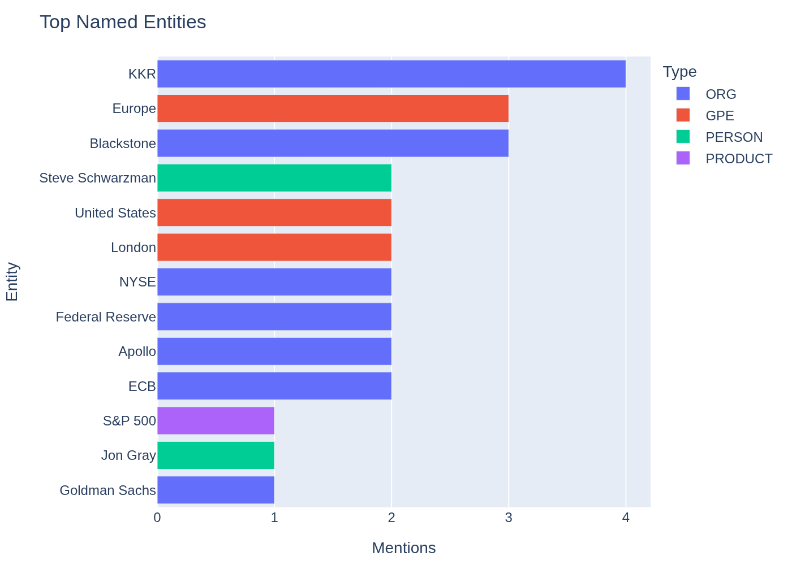

# Financial Intelligence Dashboard

> **FinBERT sentiment · LLM structured extraction · SEC EDGAR filings · Portfolio monitor — built for alternative assets analysis.**

Multi-ticker portfolio scanner and SEC filing analyser targeting the workflows of institutional alternative asset managers (Private Equity, Infrastructure, Real Assets, Private Credit).

Originally designed as a demonstration of applied NLP for the Munich Re GIM Alternative Assets team.

---

## What it does

| Feature | Description |
|---|---|
| **News Sentiment** | FinBERT classifies live Yahoo Finance news per ticker; spaCy NER extracts entities |
| **LLM Investment Briefing** | Qwen2.5-72B generates a 3-sentence portfolio-manager brief from headlines |
| **SEC EDGAR Filing Ingest** | Fetches real 8-K / 10-K from `data.sec.gov` — no API key required |
| **LLM Structured Extraction** | Extracts IRR, AUM, TVPI, DPI, key risks & opportunities as typed JSON from free text |
| **Portfolio Monitor** | Batch-scan multiple tickers; colour-coded heatmap of sentiment across holdings |
| **CSV Export** | All results downloadable for Databricks / Power BI integration |

---

## Screenshots

| Sentiment Distribution | Sentiment Over Time |
|:---:|:---:|
|  |  |

| Score Distribution | Sentiment by Ticker |
|:---:|:---:|
|  |  |

**Portfolio Sentiment Heatmap**


**LLM-Extracted Fund KPIs from SEC EDGAR Filings**


**Top Named Entities**



---

## Quickstart

```bash
# 1. Clone
git clone https://github.com/hades2905/fintext-signal-dashboard
cd fintext-signal-dashboard

# 2. Create virtual environment
python -m venv .venv && source .venv/bin/activate

# 3. Install dependencies
pip install -r requirements.txt

# 4. Download spaCy model
python -m spacy download en_core_web_sm

# 5. Set your free HuggingFace token (https://huggingface.co/settings/tokens)
export HF_TOKEN=hf_...

# 6. Run dashboard  (three tabs: 📰 News · 📂 EDGAR · 🏦 Portfolio)
streamlit run dashboard/app.py
```

All data sources are free. Only FinBERT + Qwen2.5-72B require a free HuggingFace token — no billing, no GPU.

---

## Models

| Task | Model | Backend | Cost |
|---|---|---|---|
| Sentiment | [ProsusAI/FinBERT](https://huggingface.co/ProsusAI/finbert) | HuggingFace Inference API | Free tier |
| Structured Extraction | [Qwen/Qwen2.5-72B-Instruct](https://huggingface.co/Qwen/Qwen2.5-72B-Instruct) | HuggingFace Inference API | Free tier |
| NER | spaCy `en_core_web_sm` | Local (~12 MB) | Free |
| News | Yahoo Finance | yfinance | Free |
| Filings | SEC EDGAR | `data.sec.gov` public API | Free |

---

## Supported Tickers (EDGAR)

| Ticker | Company | Strategy |
|---|---|---|
| BX | Blackstone Inc. | PE / RE / Credit / Infra |
| KKR | KKR & Co. | PE / Credit / Infra |
| APO | Apollo Global Management | PE / Credit |
| ARES | Ares Management | Credit / PE / RE |
| CG | Carlyle Group | PE / Credit / RE |
| BAM | Brookfield Asset Management | Infra / RE / PE |

Any other ticker is supported via Yahoo Finance news. CIK auto-lookup handles unknown EDGAR tickers.

---

## Real Example Data

All outputs below are fetched from **live APIs** (no mocks). Refresh anytime:

```bash
python examples/fetch_real_data.py
```

### Example data (`examples/data/`)
- `news_articles.json` — 30 real articles with NER annotations
- `news_articles_scored.json` — same + FinBERT sentiment scores per article
- `edgar_filings.json` — 4 real 8-K filings (BX + KKR) with press-release text
- `llm_extractions.json` — Qwen2.5-72B structured extracts from each filing
- `investment_briefings.json` — Qwen2.5-72B PM briefings for BX / KKR / APO
- `top_entities.json` — top 20 named entities by mention count

### LLM Structured Extract — real output (Qwen2.5-72B · `examples/data/llm_extractions.json`)

**BX — Q4 2025 Earnings (2026-01-29)**
```json
{
  "fund_or_entity_name": "Blackstone",
  "geography": "Global",
  "aum_bn_usd": 1300.0,
  "overall_sentiment": "positive",
  "investment_summary": "Blackstone's strong performance in Q4 2025, with record inflows and a focus on large-scale investments in digital and energy infrastructure, positions it well for continued growth."
}
```

**KKR — Arctos Acquisition (2026-02-05)**
```json
{
  "fund_or_entity_name": "Arctos Partners",
  "strategy": "Other",
  "geography": "North America",
  "aum_bn_usd": 15.0,
  "vintage_year": 2019,
  "overall_sentiment": "positive",
  "key_opportunities": [
    "Better serve the sports industry and the sponsor community",
    "Access to strategic, financial and operational resources to accelerate existing businesses",
    "Leverage KKR's broad range of products and capabilities"
  ],
  "investment_summary": "Arctos Partners, a leader in sports franchise investments and GP solutions, is being acquired by KKR, enhancing its capabilities and positioning for growth."
}
```

### Investment Briefing — real output (Qwen2.5-72B · `examples/data/investment_briefings.json`)

**BX:**
> _"The overall sentiment for Blackstone (BX) is decidedly negative, as evidenced by multiple headlines highlighting issues such as redemptions testing liquidity, shares trading below fair value, and significant price slides, which overshadow the few neutral updates on sector performance and leadership actions. A key risk identified is the potential for further liquidity constraints and valuation pressures in BX's private credit and real estate portfolios, particularly given the company's recent challenges in Asia and ongoing market skepticism. It is recommended to closely monitor BX's quarterly earnings reports and any updates on redemption activities, as well as to assess the broader implications of these risks on the alternative asset management sector."_

**KKR:**
> _"The overall sentiment for KKR is mixed, leaning slightly negative, as evidenced by a higher proportion of negative headlines, including concerns over technical inflection points in private-credit stocks and record redemptions in Blackstone's private credit fund, which may reflect broader industry challenges. A key opportunity lies in the positive outlook from RBC Capital's initiation of coverage with an outperform call, suggesting potential upside despite current market skepticism. It is recommended to closely monitor KKR's performance in private credit and any further insider buying activity, as these factors could provide early signals of recovery or continued distress."_

---

## Development

### Run tests

```bash
# Unit tests (offline, no network, ~7 s)
pytest -m "not integration"

# Integration tests (live yfinance + EDGAR, ~60 s)
pytest -m integration -v

# All tests + coverage
pytest --cov=src --cov-report=term-missing
```

Unit tests run fully offline (all HTTP mocked). Integration tests hit live EDGAR + Yahoo Finance.

---

## Relevance to Alternative Asset Management

This project is directly applicable to the following institutional workflows:

- **Automated GP letter / fund update ingestion** – LLM extracts fund KPIs without manual reading
- **Portfolio monitoring** – batch sentiment scan of portfolio companies identifies emerging risks
- **Regulatory filing surveillance** – 8-K monitoring for material events in portfolio holdings
- **Quantitative research** – sentiment scores as factor signals for allocation models


